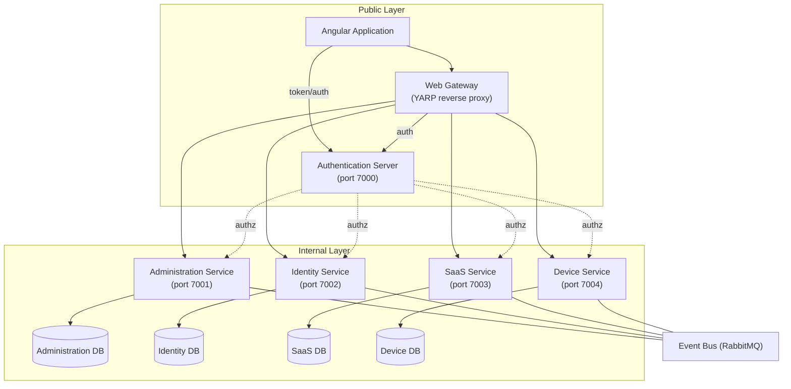

# TDM — Test Device Management

TDM is a microservices-based application for managing shared test devices (phones, tablets, etc.) within an organization — tracking device inventory, and letting users check devices out and back in via booking records.

It is built on the [ABP Framework](https://abp.io/) and split into independently deployable services (device management, identity, administration, SaaS/tenant management) fronted by an API gateway, with an Angular single-page application as the primary client.

## Features

**Implemented**
1. Login / Logout (OAuth2/OIDC via the Auth Server)
2. Permission management (Tenant, Role, User)
3. CRUD Users (user and sub-user)
4. CRUD Devices
5. Booking process (checkout / return)

**Planned / Not yet implemented**
1. Dedicated booking form
2. Device favorites
3. Booking history
4. Notifications when a favorited device is booked by someone else

## Architecture

Infrastructure is split into two layers:

- **Public Layer** — Angular Application, Authentication Server, and Web Gateway (internet/client-facing).
- **Internal Layer** — Administration Service, Identity Service, SaaS Service, Device Management Service, plus shared infrastructure (Redis cache, RabbitMQ event bus, and future services).



Full diagram source: [Google Drive — Test Device Management Diagram](https://drive.google.com/file/d/1xtUZTwB8d33LnMU1tF1JX5ZrtR1uIQB8/view?usp=sharing)

Each service follows Domain-Driven Design as suggested by ABP, and all services' EF Core migrations are applied together by running the shared migration console app (`TDM.DbMigrator`); each service also has its own `Dockerfile` for containerized deployment.

## Tech Stack

**Backend**
- [.NET 8](https://dotnet.microsoft.com/) / ASP.NET Core
- [ABP Framework](https://abp.io/) 8.0.5 (`Volo.Abp.*`) — modular DDD application framework
- [YARP](https://microsoft.github.io/reverse-proxy/) (`Yarp.ReverseProxy`) — API gateway / reverse proxy
- Entity Framework Core 8 with SQL Server (`Volo.Abp.EntityFrameworkCore.SqlServer`)
- OpenIddict-based Auth Server for OAuth2/OIDC authentication
- Redis — distributed caching
- RabbitMQ — distributed event bus between services
- AutoMapper — DTO/entity mapping

**Frontend**
- [Angular 17](https://angular.io/)
- ABP Angular libraries (`@abp/ng.core`, `@abp/ng.account`, `@abp/ng.identity`, `@abp/ng.tenant-management`, `@abp/ng.setting-management`, `@abp/ng.oauth`, `@abp/ng.theme.lepton-x`, `@abp/ng.theme.shared`)
- RxJS, Bootstrap Icons

**Tooling / Infra**
- [Tye](https://github.com/dotnet/tye) (`tye.yaml`) — running/orchestrating all services locally
- Docker (per-service `Dockerfile` and `docker-compose.yml`)
- xUnit + ABP TestBase (backend unit/integration tests)
- Karma/Jasmine (Angular unit tests)
- PowerShell scripts (`init.ps1`, `newservice.ps1`) for scaffolding new services with the ABP CLI

## Directory Structure

```
TestDeviceManagement/
├── TDM.sln                    # Solution file referencing all backend projects
├── tye.yaml                   # Local multi-service run configuration (Project Tye)
├── init.ps1                   # Scaffolds the initial solution structure via the ABP CLI
├── newservice.ps1             # Scaffolds a new microservice module via the ABP CLI
│
├── apps/
│   ├── TDM.AuthServer/        # ABP Auth Server (OpenIddict) — login, token issuance
│   └── angular/                # Angular 17 SPA (the end-user web client)
│
├── gateway/
│   └── TDM.Gateway/           # YARP reverse-proxy API gateway routing /api/* to services
│
├── services/                  # Independently deployable ABP microservices
│   ├── administration/        # Audit logging, feature/permission/setting management
│   ├── identity/              # Users, roles, identity management (Volo.Identity)
│   ├── saas/                  # Multi-tenancy / SaaS tenant management
│   └── device/                # Core domain: devices, bookings, users
│       ├── src/
│       │   ├── TDM.DeviceService.Domain/            # Device, DeviceBooking, UserBooking entities
│       │   ├── TDM.DeviceService.Domain.Shared/      # Enums (DeviceType, DeviceStatus), constants
│       │   ├── TDM.DeviceService.Application/        # App services (business logic)
│       │   ├── TDM.DeviceService.Application.Contracts/ # DTOs and app service interfaces
│       │   ├── TDM.DeviceService.EntityFrameworkCore/ # EF Core DbContext, migrations
│       │   ├── TDM.DeviceService.HttpApi/            # ASP.NET Core controllers
│       │   └── TDM.DeviceService.HttpApi.Client/     # Typed HTTP client for other services
│       ├── host/TDM.DeviceService.HttpApi.Host/      # Runnable web host for this service
│       ├── database/                                 # SQL Server Dockerfile/entrypoint
│       └── test/                                      # xUnit test projects (Domain/Application/EF Core)
│
├── shared/
│   ├── TDM.DbMigrator/           # Console app that applies EF Core migrations & seeds data
│   ├── TDM.Microservice.Shared/  # Shared module wiring administration data into other services
│   └── TDM.Shared.Hosting/       # Shared ASP.NET Core hosting module (common startup config)
│
└── .dockerignore / .gitignore
```

Each of `services/administration`, `services/identity`, `services/saas`, and `services/device` follows the same ABP-generated layered structure (`Domain.Shared → Domain → Application.Contracts → Application → EntityFrameworkCore → HttpApi → HttpApi.Client`, plus a `host` and `test` folder), scaffolded by `newservice.ps1`.

## Installation

### System Requirements

- [.NET 8 SDK](https://dotnet.microsoft.com/download/dotnet/8.0)
- [Node.js](https://nodejs.org/) and Yarn/npm (Angular app uses a `yarn.lock`; `package-lock.json` is also present)
- [Angular CLI](https://angular.io/cli) `~17.0.0`
- SQL Server (each service has its own database; a `database/Dockerfile` per service is provided)
- Redis (distributed caching)
- RabbitMQ (event bus)
- PowerShell (for `init.ps1` / `newservice.ps1` scaffolding scripts)
- [ABP CLI](https://abp.io/docs/latest/cli) (`dotnet tool install -g Volo.Abp.Cli`) — only needed for scaffolding new services
- [Tye](https://github.com/dotnet/tye) (`dotnet tool install -g Microsoft.Tye`) — optional, for running all backend services together

### Steps

1. Clone the repository:
   ```bash
   git clone <repository-url>
   cd TestDeviceManagement
   ```
2. Restore backend dependencies:
   ```bash
   dotnet restore TDM.sln
   ```
3. Install frontend dependencies:
   ```bash
   cd apps/angular
   yarn install   # or: npm install
   cd ../..
   ```
4. Provision infrastructure: start SQL Server, Redis, and RabbitMQ (locally, or via each service's `docker-compose.yml`, e.g. `docker compose -f services/device/docker-compose.yml -f services/device/docker-compose.override.yml up -d`).
5. Update connection strings in each service's `appsettings.json` (`ConnectionStrings`, `Redis`, `RabbitMQ` sections) to match your local environment.
6. Run database migrations and seed data:
   ```bash
   dotnet run --project shared/TDM.DbMigrator/TDM.DbMigrator.csproj
   ```

## Usage

### Development mode

Run all backend services together with Tye:
```bash
tye run
```
This starts the Auth Server (`:7000`), Gateway (`:7500`), Administration Service (`:7001`), Identity Service (`:7002`), SaaS Service (`:7003`), and Device Service (`:7004`), per `tye.yaml`.

> The project's design notes list the Gateway on port `7005`; the checked-in `tye.yaml` and `launchSettings.json` currently run it on `7500` — use `7500` for local development, since that reflects the actual configuration.

Alternatively, run an individual service:
```bash
dotnet run --project apps/TDM.AuthServer/TDM.AuthServer.csproj
dotnet run --project gateway/TDM.Gateway/TDM.Gateway.csproj
dotnet run --project services/device/host/TDM.DeviceService.HttpApi.Host/TDM.DeviceService.HttpApi.Host.csproj
```

Run the Angular frontend (served on `http://localhost:4200`):
```bash
cd apps/angular
yarn start   # ng serve --open
```

### Build

```bash
dotnet build TDM.sln
```
```bash
cd apps/angular
npm run build            # development build
npm run build:prod       # production build
```

### Tests

Backend (xUnit, per service — example for Device Service):
```bash
dotnet test services/device/TDM.DeviceService.sln
```

Frontend (Karma/Jasmine):
```bash
cd apps/angular
npm test
```

## Configuration / Environment Variables

This project does not use a `.env` file — configuration is done through each ASP.NET Core project's `appsettings.json` / `appsettings.Development.json` / `appsettings.secrets.json` (or environment variable overrides, e.g. in `docker-compose.override.yml`). Key settings per service:

| Setting | Description |
|---|---|
| `ConnectionStrings:*` | SQL Server connection strings (one per service database, e.g. `DeviceService`, `IdentityService`) |
| `Redis:Configuration` | Redis host used for distributed caching |
| `RabbitMQ:Connections:Default:HostName` | RabbitMQ host for the distributed event bus |
| `RabbitMQ:EventBus:ClientName` / `ExchangeName` | Event bus client/exchange identifiers |
| `AuthServer:Authority` | URL of the Auth Server used to validate tokens |
| `AuthServer:SwaggerClientId` / `SwaggerClientSecret` | OAuth client used by each service's Swagger UI |
| `App:CorsOrigins` / `App:SelfUrl` / `App:ClientUrl` | CORS and self-referencing URLs per app |
| `StringEncryption:DefaultPassPhrase` | Passphrase used by ABP for string encryption |

The Angular app's equivalent configuration lives in `apps/angular/src/environments/environment.ts` (`oAuthConfig`, `apis.default.url`, etc.) rather than a `.env` file.

> The committed `appsettings.json` files contain local development defaults (including placeholder secrets). Replace connection strings, client secrets, and passphrases before deploying to any shared or production environment.

## Main Features / API

The API Gateway (`gateway/TDM.Gateway`) exposes each service's API under a routed path:

| Route prefix | Service | Port (direct) |
|---|---|---|
| `/api/identity/*` | Identity Service | `7002` |
| `/api/account/*` | Identity Service (account) | `7002` |
| `/api/multi-tenancy/*` | SaaS Service | `7003` |
| `/api/device/*` | Device Service | `7004` |
| *(catch-all)* | Administration Service | `7001` |

Each backend service also exposes a Swagger UI at its host root for interactive API exploration.

**Device Service** (the core business domain):
- **Devices** (`IDeviceAppService`) — full CRUD for devices, each with a `Name`, `DeviceType` (`Unknown`, `Tablet`, `SmartPhone`), and `DeviceStatus` (`Available`, `Unavailable`).
- **Device Bookings** (`IDeviceBookingAppService`) — full CRUD for bookings, plus:
  - `CheckoutDevice(deviceId)` — check out a device to a user.
  - `BookingReturn(deviceId)` — return a checked-out device.
- **User Booking Information** (`IUserBookingAppService`) — full CRUD for the users allowed to book devices, plus `CreateUpdateUserBooking(userId, dto)`.

**Identity Service** (port `7002`) — manages users and roles; exposes OpenID Connect for token, scope, and permission management; publishes/consumes events via the event bus. Built on `Volo.Identity`.

**Administration Service** (port `7001`) — manages features and permissions across the platform; publishes/consumes events via the event bus (`Volo.Abp.AuditLogging`, `Volo.Abp.FeatureManagement`, `Volo.Abp.PermissionManagement`, `Volo.Abp.SettingManagement`).

**SaaS Service** (port `7003`) — manages tenants (multi-tenancy) and participates in the event bus (`Volo.Abp.TenantManagement`).

**Auth Server** (`apps/TDM.AuthServer`, port `7000`) — issues OAuth2/OIDC tokens (hybrid and authorization-code flows); requires the Administration, Identity, and SaaS modules to be available.

## Scaffolding New Services

The repo's PowerShell scripts wrap the ABP CLI for initial setup and adding new microservices:

```powershell
# One-time: scaffold the initial solution (apps, gateway, shared, and the first services)
./init.ps1 TDM

# Add a new microservice module under services/<name>
./newservice.ps1 ServiceName
```

## Links

- Source code: https://github.com/BrianPhan95/TestDeviceManagement
- Architecture diagram: https://drive.google.com/file/d/1xtUZTwB8d33LnMU1tF1JX5ZrtR1uIQB8/view?usp=sharing
